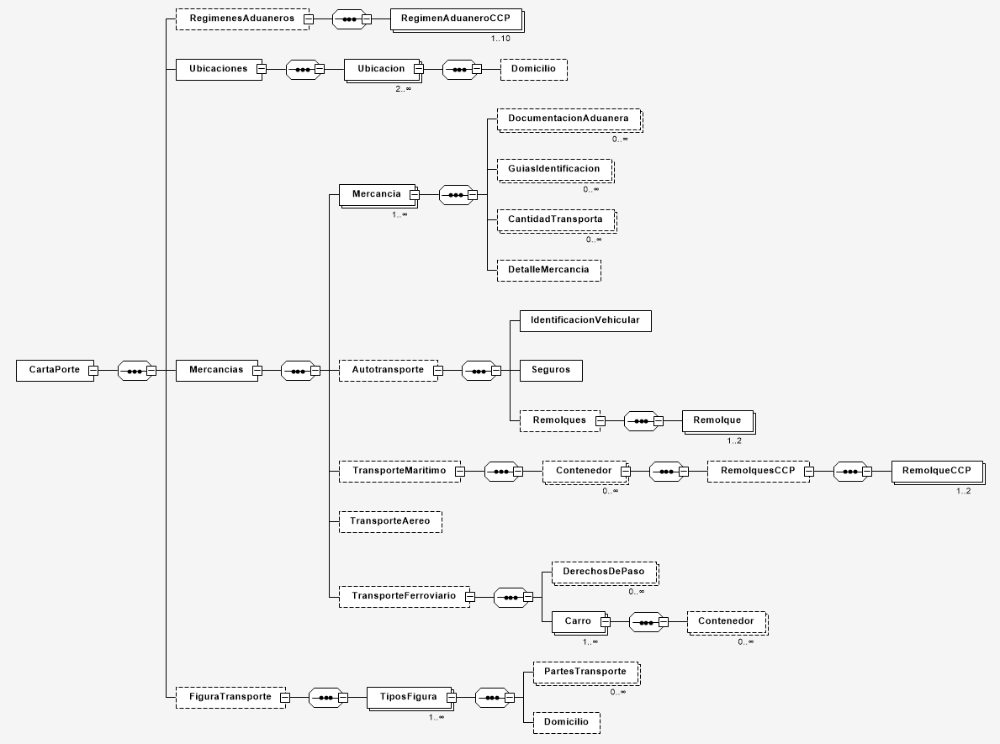

# Complemento de Carta Porte 3.1

El espacio de nombres de `CfdiUtils\Elements\CartaPorte31` permite trabajar en forma más fácil con los nodos
con nombres y acciones específicas para implementar el Complemento de Carta Porte versión 3.1, vigente a
partir del 17 de julio del 2024.

La documentación del complemento la puedes encontrar en el sitio oficial del SAT:

- La ruta del archivo de excel con los nuevos catálogos: <http://omawww.sat.gob.mx/tramitesyservicios/Paginas/documentos/CatalogosCartaPorte31.xls>.
- Ruta del XSD del CCP 3.1: <http://www.sat.gob.mx/sitio_internet/cfd/CartaPorte/CartaPorte31.xsd>.
- Ruta del XSLT para la secuencia de cadena original CCP 3.1: <http://www.sat.gob.mx/sitio_internet/cfd/CartaPorte/CartaPorte31.xslt>.
- Ruta matriz de errores CCP 3.1: <http://omawww.sat.gob.mx/tramitesyservicios/Paginas/documentos/Matriz_Errores_CCP_V31.xls>.
- Ruta XSD catálogos CCP 3.1: <http://www.sat.gob.mx/sitio_internet/cfd/catalogos/CartaPorte/catCartaPorte.xsd>.
- Ruta del estándar: <http://omawww.sat.gob.mx/tramitesyservicios/Paginas/documentos/Carta_Porte_31.pdf>.

Según la documentación técnica el XML debe cumplir con la siguiente especificación:

- Prefijo de namespace: `CartaPorte31`.
- Namespace: <http://www.sat.gob.mx/CartaPorte31>.
- Archivo XSD: <http://www.sat.gob.mx/sitio_internet/cfd/CartaPorte/CartaPorte31.xsd>.

## Jerarquía de nodos

En la siguiente imagen se puede ver la jerarquía, el orden y el número de apariciones mínimas y máximas de los nodos en el Complemento Carta Porte 3.1.



## Métodos para agregar nodos

Los métodos de ayuda para nodos de máximo una sola aparición tienen la forma `getElemento(): Elemento`
y `addElemento(array $attributes): Elemento`. En donde `Elemento` se sustituye por el nombre del nodo.
En este caso, `addElemento` siempre trabaja con el elemento que previamente exista.

Los métodos de ayuda para nodos de múltiples apariciones tienen la forma `addElemento(array $attributes): Elemento`
y `multiElemento(array $attributes): self`. En donde `Elemento` se sustituye por el nombre del nodo y `self` es el
elemento que contiene el componente.
En este caso, `addElemento` siempre agrega un nuevo elemento.

```php
<?php
$nomina = new \CfdiUtils\Elements\CartaPorte31\CartaPorte();

// acceso por prefijo get (Ubicaciones es de 1 aparición)
$ubicaciones = $CartaPorte31->getUbicaciones();

// agregar con prefijo add (Ubicacion es de 1 aparición)
$ubicacion = $ubicaciones->addUbicacion(['TipoUbicacion'=> 'Origen', ...]);

// agregar con prefijo multi (Domicilio es de múltiples)
$ubicacion->multiDomicilio(
    ['Calle' => 'xxx', 'NumeroExterior' => 'xxx', ...],
    ['Calle' => 'xxx', 'NumeroExterior' => 'xxx', ...]
);
```

### Métodos de ayuda de los elementos

#### Elemento `Carta Porte`

- `CartaPorte::getUbicaciones(): Ubicaciones`.
- `CartaPorte::addUbicaciones(array $attributes): Ubicaciones`.
- `CartaPorte::getMercancias(): Mercancias`.
- `CartaPorte::addMercancias(array $attributes): Mercancias`.
- `CartaPorte::getFiguraTransporte(): FiguraTransporte`.
- `CartaPorte::addFiguraTransporte(array $attributes): FiguraTransporte`.

#### Elemento `RegimenesAduaneros`

- `RegimenesAduaneros::addRegimenAduaneroCCP(array $attributes): RegimenAduaneroCCP`.
- `RegimenesAduaneros::multiRegimenAduaneroCCP(array $attributes): self`.

#### Elemento `Ubicaciones`

- `Ubicaciones::addUbicacion(array $attributes): Ubicacion`.
- `Ubicaciones::multiUbicacion(array ...$elementAttributes): self`.

#### Elemento `Ubicacion`

- `Ubicacion::getDomicilio(): Domicilio`.
- `Ubicacion::addDomicilio(array $attributes): Domicilio`.

#### Elemento `Mercancias`

- `Mercancias::addMercancia(array $attributes): Mercancia`.
- `Mercancias::multiMercancia(array ...$elementAttributes): self`.
- `Mercancias::getAutotransporte(): Autotransporte`.
- `Mercancias::addAutotransporte(array $attributes): Autotransporte`.
- `Mercancias::getTransporteMaritimo(): TransporteMaritimo`.
- `Mercancias::addTransporteMaritimo(array $attributes): TransporteMaritimo`.
- `Mercancias::getTransporteAereo(): TransporteAereo`.
- `Mercancias::addTransporteAereo(array $attributes): TransporteAereo`.
- `Mercancias::getTransporteFerroviario(): TransporteFerroviario`.
- `Mercancias::addTransporteFerroviario(array $attributes): TransporteFerroviario`.

#### Elemento `Mercancia`

- `Mercancia::addDocumentacionAduanera(array $attributes): DocumentacionAduanera`.
- `Mercancia::multiDocumentacionAduanera(array ...$elementAttributes): self`.
- `Mercancia::addGuiasIdentificacion(array $attributes): GuiasIdentificacion`.
- `Mercancia::multiGuiasIdentificacion(array ...$elementAttributes): self`.
- `Mercancia::addCantidadTransporta(array $attributes): CantidadTransporta`.
- `Mercancia::multiCantidadTransporta(array ...$elementAttributes): self`.
- `Mercancia::getDetalleMercancia(): DetalleMercancia`.
- `Mercancia::addDetalleMercancia(array $attributes): DetalleMercancia`.

#### Elemento `Autotransporte`

- `Autotransporte::getIdentificacionVehicular(): IdentificacionVehicular`.
- `Autotransporte::addIdentificacionVehicular(array $attributes): IdentificacionVehicular`.
- `Autotransporte::getSeguros(): Seguros`.
- `Autotransporte::addSeguros(array $attributes): Seguros`.
- `Autotransporte::getRemolques(): Remolques`.
- `Autotransporte::addRemolques(array $attributes): Remolques`.

#### Elemento `Remolques`

- `Remolques::addRemolque(array $attributes): Remolque`.
- `Remolques::multiRemolque(array ...$elementAttributes): self`.

#### Elemento `TransporteMaritimo`

- `TransporteMaritimo::addContenedor(array $attributes): Contenedor`.
- `TransporteMaritimo::multiContenedor(array ...$elementAttributes): self`.
- `TransporteMaritimo::getRemolquesCCP(): RemolquesCCP`.
- `TransporteMaritimo::addRemolquesCCP(array $attributes): RemolquesCCP`.

#### Elemento `RemolquesCCP`

- `RemolquesCCP::addRemolque(array $attributes): Remolque`.
- `RemolquesCCP::multiRemolque(array ...$elementAttributes): self`.

#### Elemento `TransporteFerroviario`

- `TransporteFerroviario::addDerechosDePaso(array $attributes): DerechosDePaso`.
- `TransporteFerroviario::multiDerechosDePaso(array ...$elementAttributes): self`.
- `TransporteFerroviario::addCarro(array $attributes): Carro`.
- `TransporteFerroviario::multiCarro(array ...$elementAttributes): self`.

#### Elemento `Carro`

- `Carro::addContenedor(array $attributes): Contenedor`.
- `Carro::multiContenedor(array ...$elementAttributes): self`.

#### Elemento `FiguraTransporte`

- `FiguraTransporte::addTiposFigura(array $attributes): TiposFigura`.
- `FiguraTransporte::multiTiposFigura(array ...$elementAttributes): self`.

#### Elemento `TiposFigura`

- `TiposFigura::addPartesTransporte(array $attributes): PartesTransporte`.
- `TiposFigura::multiPartesTransporte(array ...$elementAttributes): self`.
- `TiposFigura::getDomicilio(): Domicilio`.
- `TiposFigura::addDomicilio(array $attributes): Domicilio`.

### Agregar el complemento carta porte al comprobante

Cuando se tiene un comprobante, se puede utilizar el método `Comprobante::addComplemento()` para insertar
el elemento `CartaPorte` al comprobante.

```php
<?php
// clase de ayuda de creación del CFDI 4.0
$creator = new \CfdiUtils\CfdiCreator40();
// acceso al elemento Comprobante (el nodo principal del CFDI)
$comprobante = $creator->comprobante();
                     
$CartaPorte31 = new \CfdiUtils\Elements\CartaPorte31\CartaPorte();
// ... llenar la información de $CartaPorte31

// agregar $CartaPorte31 como complemento del $comprobante
$comprobante->addComplemento($CartaPorte31);
```
