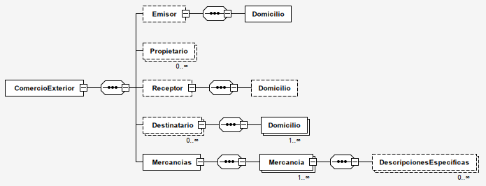

# Complemento de Comercio Exterior 2.0

El espacio de nombres de `CfdiUtils\Elements\Cce20` permite trabajar en forma más fácil con los nodos
con nombres y acciones específicas para implementar el Complemento de Comercio Exterior versión 2.0,
vigente a partir del 15 de enero del 2024.

La documentación del complemento la puedes encontrar en el sitio oficial del SAT:

- Documentación Comercio Exterior 2.0: <http://omawww.sat.gob.mx/tramitesyservicios/Paginas/complemento_comercio_exterior.htm>.
- Catálogos: <http://omawww.sat.gob.mx/tramitesyservicios/Paginas/catalogos_emision_cfdi_complemento_ce.htm>.
- Ruta del estándar: <http://omawww.sat.gob.mx/tramitesyservicios/Paginas/documentos/EstandarComercioExterior_v20.pdf>.

Según la documentación técnica el XML debe cumplir con la siguiente especificación:

- Prefijo de namespace: `cce20`.
- Namespace: `http://www.sat.gob.mx/ComercioExterior20`.
- Archivo XSD: `http://www.sat.gob.mx/sitio_internet/cfd/ComercioExterior20/ComercioExterior20.xsd`.

## Cambios con respecto a Comercio Exterior 1.1

Si ya se había implementado el Complemento de Comercio Exterior 1.0 notarás que los cambios de estructura son mínimos:

- `ComercioExterior/Emisor/Domicilio` ahora es obligatorio.
- `ComercioExterior/Mercancias` ahora es obligatorio.
- `ComercioExterior/Mercancias/Mercancia@ValorUnitarioAduana` ahora admite 6 decimales.
- `ComercioExterior/Mercancias/Mercancia@ValorDolares` ahora admite 4 decimales.
- `ComercioExterior@Version` cambia de 1.1 a 2.0
- `ComercioExterior@TipoOperacion` fue eliminado.
- `ComercioExterior@Subdivision` fue eliminado.
- `ComercioExterior@ClaveDePedimento` ahora es obligatorio.
- `ComercioExterior@CertificadoOrigen` ahora es obligatorio
- `ComercioExterior@TipoCambioUSD` ahora es obligatorio
- `ComercioExterior@TotalUSD` ahora es obligatorio

## Jerarquía de nodos

En la siguiente imagen se puede ver la jerarquía, el orden y el número de apariciones mínimas y máximas de los nodos en el Complemento de Comercio Exterior 2.0.



## Métodos para agregar nodos

Los métodos de ayuda para nodos de máximo una sola aparición tienen la forma `getElemento(): Elemento`
y `addElemento(array $attributes): Elemento`. En donde `Elemento` se sustituye por el nombre del nodo.
En este caso, `addElemento` siempre trabaja con el elemento que previamente exista.

Los métodos de ayuda para nodos de múltiples apariciones tienen la forma `addElemento(array $attributes): Elemento`
y `multiElemento(array $attributes): self`. En donde `Elemento` se sustituye por el nombre del nodo y `self` es el
elemento que contiene el componente.
En este caso, `addElemento` siempre agrega un nuevo elemento.

```php
<?php
$cce = new \CfdiUtils\Elements\Cce20\ComercioExterior();

// acceso por prefijo get (Mercancias es de 1 aparición)
$mercancias = $cce->getMercancias();

// agregar con prefijo add (Mercancia es de 1 aparición)
$mercancia = $mercancias->addMercancia(['NoIdentificacion'=> 'PN001122', ...]);

// agregar con prefijo multi (DescripcionesEspecificas es de múltiples)
$mercancia->multiDescripcionesEspecificas(
    ['Marca' => 'Hitachi', 'Modelo' => 'XB-112244', ...],
    ['Marca' => 'Samsung', 'Modelo' => 'ECL-1-PXE', ...]
);
```

### Métodos de ayuda de los elementos

#### Elemento `ComercioExterior`

- `ComercioExterior::getEmisor(): Emisor`.
- `ComercioExterior::addEmisor(array $attributes): Emisor`.
- `ComercioExterior::addPropietario(array $attributes): Propietario`.
- `ComercioExterior::multiPropietario(array ...$elementAttributes): self`.
- `ComercioExterior::getReceptor(): Receptor`.
- `ComercioExterior::addReceptor(array $attributes): Receptor`.
- `ComercioExterior::addDestinatario(array $attributes): Destinatario`.
- `ComercioExterior::multiDestinatario(array ...$elementAttributes): self`.
- `ComercioExterior::getMercancias(): Mercancias`.
- `ComercioExterior::addMercancias(array $attributes): Mercancias`.

#### Elemento `Emisor`

- `Emisor::getDomicilio(): Domicilio`.
- `Emisor::addDomicilio(array $attributes): Domicilio`.

#### Elemento `Receptor`

- `Emisor::getDomicilio(): Domicilio`.
- `Emisor::addDomicilio(array $attributes): Domicilio`.

#### Elemento `Destinatario`

- `Emisor::addDomicilio(array $attributes): Domicilio`.
- `Emisor::multiDomicilio(array ...$elementAttributes): self`.

#### Elemento `Mercancias`

- `Emisor::addMercancias(array $attributes): Mercancias`.
- `Emisor::multiMercancias(array ...$elementAttributes): self`.

#### Elemento `Mercancia`

- `Emisor::addDescripcionesEspecificas(array $attributes): DescripcionesEspecificas`.
- `Emisor::multiDescripcionesEspecificas(array ...$elementAttributes): self`.

### Agregar el Complemento de Comercio Exterior al comprobante

Cuando se tiene un comprobante, se puede utilizar el método `Comprobante::addComplemento()` para insertar
el elemento `ComercioExterior` al comprobante.

```php
<?php
// clase de ayuda de creación del CFDI 4.0
$creator = new \CfdiUtils\CfdiCreator40();
// acceso al elemento Comprobante (el nodo principal del CFDI)
$comprobante = $creator->comprobante();
                     
$cce20 = new \CfdiUtils\Elements\Cce20\ComercioExterior();
// llenar la información de $cce20

// agregar $cce20 como complemento del $comprobante
$comprobante->addComplemento($cce20);
```
